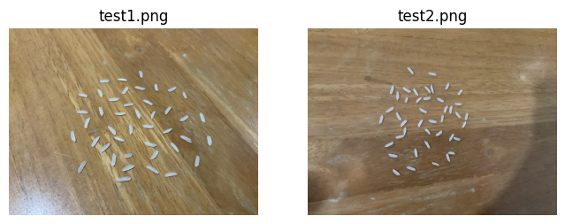
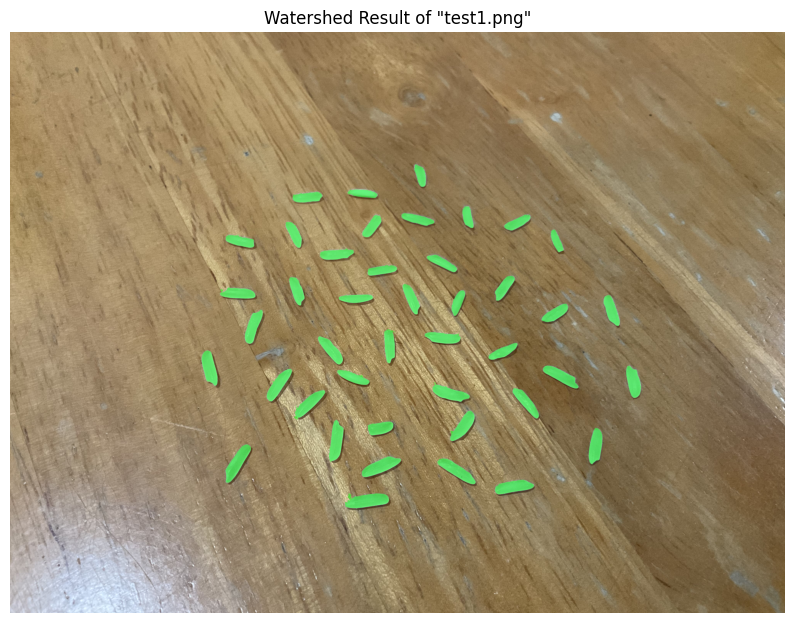
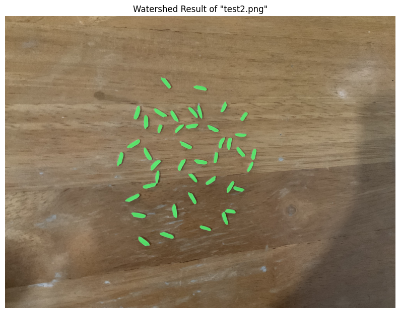
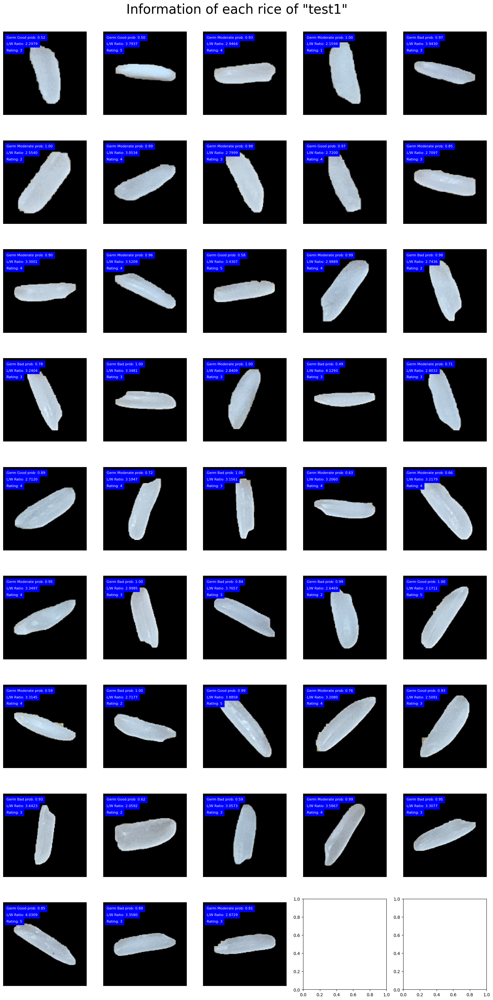

# Jasmine Rice Quality Rating
Thai jasmine rice is considered one of the world’s most delicious cultivars of rice. Is there anyway we could identify this type of rice out of others and check their quality?

Our goal is to identify and segment out the Jasmine Rice given in a specific picture and evaluate the overall quality of the rice in that picture.

## Technical Challenges
- Each type of rice is hard to differentiate from each other.
- How do we define the “quality” of rice?
- Are there any datasets available? Is it suitable with the project?
- How can we create and train this model for the best results?

## Usage
1. Clone the repository:
   ```bash
   git clone https://github.com/TeaChanathip/Jasmine-Rice-Quality-Rating.git
   ```
2. Navigate to the project directory:
   ```bash
   cd Jasmine-Rice-Quality-Rating
   ```
3. Install dependencies:
   Option 1: Using Conda (recommended)
     1. Create a new conda environment from the `environment.yaml` file:
        ```bash
        conda env create -f environment.yaml
        ```
     2. Activate the conda environment:
        ```bash
        conda activate cv_term_project
        ```
   Option 2: Using Pip
     1. Create a virtual environment
        ```bash
        python3 -m venv venv
        ```
     2. Activate the virtual environment:
        - On Windows:
          ```bash
          venv\Scripts\activate
          ```
        - On macOS/Linux:
          ```bash
          source venv/bin/activate
          ```
     3. Install the dependencies:
        ```bash
        pip install -r requirements.txt
        ```
4. Copy your testing images into `./test` folder
5. Open and run all `main-application.ipynb`
6. Check running results in `./output/run-{running-time-stamp}` folder
  
## Project Overview
- Reading the image
    - Image should be in `jpg` format
- Preprocessing the image for segmentation
    - Resize all images to `1440x1440`
- Segmentation Methods
    - Use `YoloV8 Segmentation` for first stage mask and predict if each rice is jasmine rice or not.
    - Then, use `Watershed` for smoothened masking.
- Classification Methods
    - Use `YoloV8 Classification` for label rice's quality as `Good`, `Moderate`, `Bad`
- Quality Measurement
    - Each rice's "quality score" are computed by 2 factors:
        1. Ratio of rice's `high`/`width` 
        2. Ratio of `#jasmine rice` / `#total rice`
- Output
    - Overall
        - Masked segmentation image
        - Overall quality score
        - Ratio of jasmine rice
    - Per rice
        - Rice's image
        - Jasmine rice indication
        - Quality label

## Firstly, Take your rices images


And put your image in the `test` folder like this:
```
root
|__ test
    |__ input1.jpg
    |__ input2.jpg
    |__ input3.jpg
    |__ ...
|__ main-application.ipynb
|__ ...
```

## Segmentation from YoloV8
Each rice was segmented using transfer learning YoloV8 segmentation model. 
This step also predicts whether each rice is jasmine rice or not.

Since the dataset only have single rice images, we had systhesized a new dataset by using various backgrounds and random original rice images. 
We also prevented the rice to collide with each other by using image overlapping check.


## Watershed Segmentation
After the segmentation from the YOLOv8 model, each rice was then segmented by the Watershed algorithm for higher quality masking. 




## Classification from YoloV8
Next, each rice was classified by transfer learning YoloV8 classification model into 3 classes: `Good`, `Moderate`, `Bad` as soft label.



The model was trained with YoloV8 as the base model with `1050` labeled rice images. There are 3 labels: `Good`, `Moderate`, `Bad`.

`Adaptive Model Training` strategy was also used to inject more unlabeled data into the training process. This results in lesser amount of loss in validation and a more stable model.

## Scoring
Each rice in the image will be scored using 2 factors:
- Ratio of width and height, this is done by:
  - Finding the contour of each rice and applying `convexHull`.
  - Finding the maxima of `high`/`width` by rotating the result from step 1.
  - Mapping the result from step 2 to score ranging from 0 to 3.
- Quality label of rice, this is done by:
  - Choosing the `maximum probability` of the soft labels from the classification result as the quality label.
  - Mapping the quality label to score ranging from 0 to 2.
The score were then summed together, giving the final score in the range from `0 to 5`.

Each image will then be scored by:
- Average of all rice's score in the image
- Map ratio of jasmine rice to score from 0 to 5
- Weighted average of 2 scores above in range from `0 to 5`

## Datasets
https://www.kaggle.com/datasets/alikhalilit98/rice-image-dataset-for-object-segmentation/data

https://www.kaggle.com/datasets/alikhalilit98/rice-image-dataset-for-object-detection
