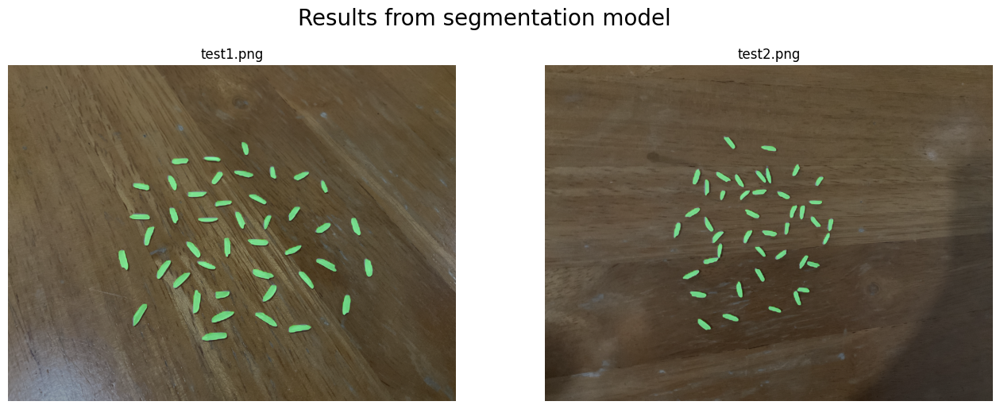

# Jasmin rice quality measurement

blah blah

## Prepare your environment
```bash
pip install -r requirements.txt
```
 
## Run Run GO GO

run run

## Overview of the project
>- Read image
>    - Should use `jpg` format
>- Preprocess image for segmentation
>    - Resize all images to `1440x1440`
>- Segmentation
>    - Use `YoloV8 Segmentation` for first stage mask >and predict if each rice is jasmine rice or not
>    - Then, use `Watershed` for quality mask
>- Classification
>    - Use `YoloV8 Classification` for label rice's quality as `Good`, `Moderate`, `Bad`
>- Quality measurement
>    - Each rice's score computed by mapping function of:
>        1. Ratio of rice's `high`/`width` 
>        2. Rotio of `#jasmine rice` / `#total rice`
>- Output
>    - Overall
>        - Segmentated image
>        - Overall quality score
>        - Ratio of jasmine rice
>    - Per rice
>        - Rice's image
>        - Jasmine rice or not
>        - Quality label

## Firstly, Take your rices images


And put your image in the `test` folder like this:
```
root
|__ test
    |__ input1.jpg
    |__ input2.jpg
    |__ input3.jpg
    |__ ...
|__ main-application.ipynb
|__ ...
```

## Segmentation from YoloV8
>Segmentation each rice by transfer learning YoloV8 segmentation model this step also predict if each rice is jasmine rice or not.

>Since dataset have only rice images, we systhesis dataset by use variace of background and random put rice images. We try to prevent rice to collide with each other by using check rectangle of each rice to prevent overlap.



>Mask results will use for next step, Watershed segmentation

## Watershed segmentation
>Segmentation each rice by Watershed algorithm to get high quality mask, initial area by result from YoloV8 segmentation.


>Watershed mask result will use for next step, Classification


## Classification from YoloV8
>Classification each rice by transfer learning YoloV8 classification model into 3 classes: `Good`, `Moderate`, `Bad` as soft label.


>Model was transfer learning from YoloV8 on `1050` of labeled rice images with 3 classes: `Good`, `Moderate`, `Bad` and suffered from overfitting due to small dataset.

>Solved by using `Adaptive model training` strategy to inject more unlabeled data into training process in the result of less loss in validation and more stable model.

## Scoring
>Each rice in the image will be scored by:
>   - Ratio of width and high
>       1. Find contour of each rice and apply `convex hull`
>       2. Find maxima of `high`/`width` by rotating result from step 1
>       3. Map result from step 2 to score from step 2 from 0 to 3
>   - Quality label of rice
>       1. Choose `maximum probability` of soft label from classification result as quality label
>       2. Map quality label to score from 0 to 2
>   - Final score in range from `0 to 5` by sum of 2 scores above

>Each image will be scored by:
>   1. Average of all rice's score in the image
>   2. Map ratio of jasmine rice to score from 0 to 5
>   3. Weighted average of 2 scores above in range from `0 to 5`